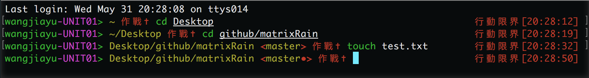

# eva-zsh-theme
An eva style zsh-theme
## Usage
1. Download the eva.zsh-theme file
2. Put it in your ```~/.oh-my-zsh/themes/```
3. In your ```~/.zshrc```, set ```ZSH_THEME="eva"```
4. ```source ~/.zshrc```
#### Effect in terminal
<p align="left">
</p>
